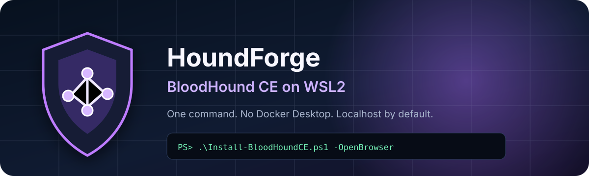

<p align="center">
  
</p>

<p align="center">
  <strong>Forge a ready-to-run BloodHound CE environment on Windows with one click.</strong><br>
  Docker Engine runs inside Linux — Docker Desktop is not required.
</p>

<p align="center">
  <a href="README.es.md">Español</a> ·
  <a href="#quick-start">Quick start</a> ·
  <a href="#security-by-default">Security</a> ·
  <a href="#troubleshooting">Troubleshooting</a>
</p>

<p align="center">
  
  
  
  
</p>

## Why this project?

**HoundForge** wraps the official BloodHound CLI in a safe Windows-first setup.
The CLI makes container management straightforward, but a
Windows workstation still needs WSL2, a compatible Linux distribution, Docker,
Compose, secure port bindings, and a repeatable startup workflow. This project
automates that setup without requiring Docker Desktop.

The installer is designed for security practitioners who want a local,
reproducible BloodHound CE environment for authorized Active Directory reviews.

## Highlights

- Detects Kali, Ubuntu, or Debian running on WSL2.
- Installs Docker Engine and Docker Compose inside WSL.
- Downloads the latest official `bloodhound-cli` release.
- Reuses existing installations without deleting data or changing credentials.
- Keeps BloodHound, Neo4j Browser, and Bolt bound to `127.0.0.1`.
- Does not publish PostgreSQL to the Windows host.
- Creates friendly start, status, credential, and stop controls on the desktop.
- Stores generated credentials only in the Linux configuration and applies
  `0600` permissions.
- Supports both AMD64 and ARM64 WSL environments.

## Quick start

### One click

1. Download or clone this repository.
2. Double-click `Install-HoundForge.cmd`.
3. Wait for the browser to open at `http://127.0.0.1:8080/ui/login`.
4. Open `BloodHound-CE\03-Credentials.cmd` on the desktop to display the
   generated local credentials.

### PowerShell

```powershell
Set-ExecutionPolicy -Scope Process Bypass
.\Install-BloodHoundCE.ps1 -OpenBrowser
```

Choose a specific distribution:

```powershell
.\Install-BloodHoundCE.ps1 -Distro kali-linux -OpenBrowser
```

Install WSL and Ubuntu when no distribution is available:

```powershell
# Run from an elevated PowerShell session
.\Install-BloodHoundCE.ps1 -InstallWslIfMissing
```

Windows may request a restart or the initial Ubuntu setup. Run the installer
again after completing that step.

## What gets installed?

```text
Windows
└── WSL2: Kali / Ubuntu / Debian
    ├── Docker Engine + Compose
    ├── /usr/local/bin/bloodhound-cli
    └── ~/.config/bloodhound
        ├── BloodHound CE
        ├── PostgreSQL
        └── Neo4j
```

The installer uses the default WSL user for BloodHound data and configuration.
System packages are installed as `root`.

## Desktop controls

After installation, the `BloodHound-CE` desktop folder contains:

| File | Purpose |
|---|---|
| `01-Start.cmd` | Starts Docker and BloodHound, then opens the UI. |
| `02-Status.cmd` | Displays container health and checks the local UI. |
| `03-Credentials.cmd` | Displays the generated credentials locally. |
| `04-Stop.cmd` | Stops the containers without deleting data. |
| `README.txt` | Short local reference. |

## Parameters

| Parameter | Description |
|---|---|
| `-Distro <name>` | Select a particular WSL distribution. |
| `-InstallWslIfMissing` | Install WSL and Ubuntu if they are absent. |
| `-DesktopFolderName <name>` | Change the desktop controls folder name. |
| `-NoDesktopControls` | Skip desktop control creation. |
| `-NoStart` | Install and leave the containers stopped. |
| `-OpenBrowser` | Open the BloodHound UI after validation. |

## Security by default

The script performs a post-deployment check and fails if Docker publishes a
container on every host interface. The expected bindings are:

| Service | Binding |
|---|---|
| BloodHound UI | `127.0.0.1:8080` |
| Neo4j Browser | `127.0.0.1:7474` |
| Neo4j Bolt | `127.0.0.1:7687` |
| PostgreSQL | Not published |

The internal BloodHound listener remains on `0.0.0.0:8080` **inside its
container** so Docker networking can reach it. The Windows-facing mapping stays
on localhost.

Do not expose these services to a corporate network or VPN without a deliberate
access-control and TLS design.

## Idempotency and data safety

Running the installer again:

- updates required system packages;
- refreshes the official BloodHound CLI binary;
- reuses the existing Compose configuration and Docker volumes;
- preserves imported data, users, and credentials.

The installer does not uninstall containers or delete volumes. Full resets are
intentionally excluded because they are destructive.

## Requirements

- Windows 10 or Windows 11.
- WSL2 with Kali, Ubuntu, or Debian.
- PowerShell 5.1 or newer.
- Internet access to the Linux package repository and GitHub Releases.
- At least 8 GB RAM recommended by BloodHound CE.
- Approximately 10 GB free disk space for a typical deployment.

## Troubleshooting

### The distribution is using WSL1

```powershell
wsl --set-version "kali-linux" 2
```

Replace `kali-linux` with the name shown by `wsl --list --verbose`.

### The UI is not ready

Use `02-Status.cmd`, or inspect logs from WSL:

```bash
bloodhound-cli running
bloodhound-cli logs
```

### Retrieve credentials without the desktop helper

Inside the selected WSL distribution:

```bash
jq '.default_admin' ~/.config/bloodhound/bloodhound.config.json
```

Treat the output as a secret and change the initial password after first login.

## Legal and ethical use

Use BloodHound only in environments you own or are explicitly authorized to
assess. Notify the relevant security team before collecting or importing
directory data. This project does not grant authorization and is not affiliated
with SpecterOps.

BloodHound is maintained by SpecterOps. This installer only automates local
deployment of the official BloodHound Community Edition containers and CLI.

## License

The installer and documentation in this repository are released under the
[MIT License](LICENSE). Third-party software retains its respective license.
